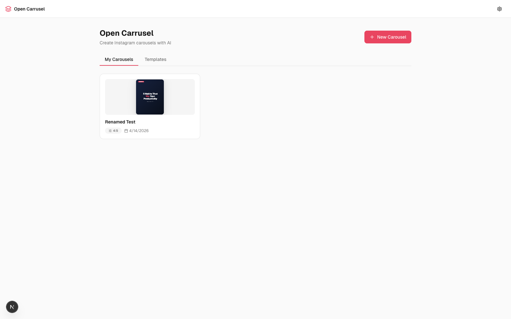
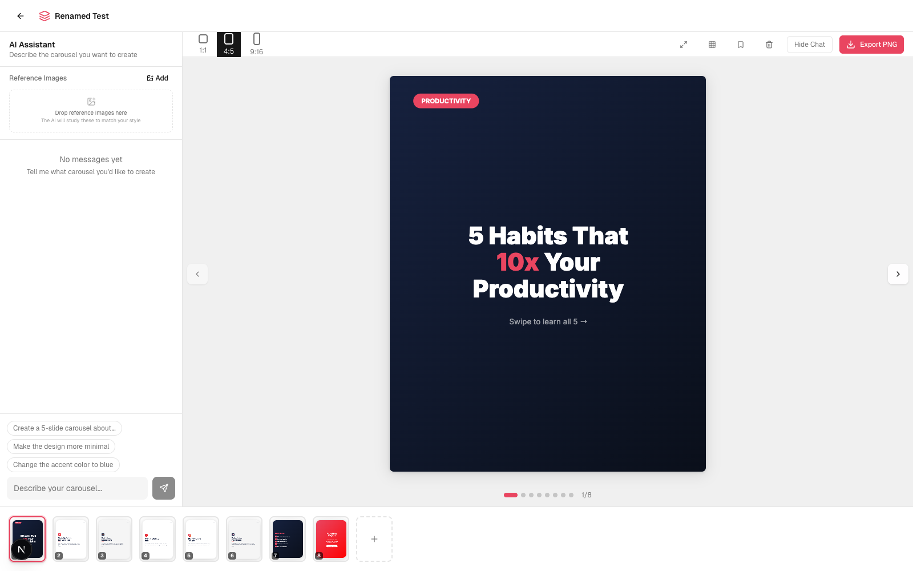
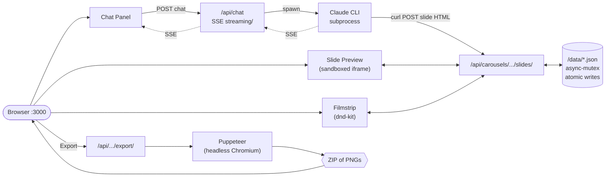

<div align="center">

# Open Social

### Chat with Claude. Design Instagram carousels. Export pixel-perfect PNGs.

**Local-first. Open source. One command to start.**

[](./LICENSE)
[](https://claude.ai)
[](https://www.tododeia.com)
[](https://nextjs.org)
[](https://react.dev)
[](https://www.typescriptlang.org)
[](https://tailwindcss.com)



</div>

---

## Table of contents

- [Why Open Social](#-why-open-social)
- [See it in action](#-see-it-in-action)
- [Quickstart (60 seconds)](#-quickstart-60-seconds)
- [What you can do](#-what-you-can-do)
- [How the AI agent works](#-how-the-ai-agent-works)
- [Slash commands](#-slash-commands)
- [Architecture](#-architecture)
- [Tech stack](#-tech-stack)
- [Project structure](#-project-structure)
- [Configuration](#%EF%B8%8F-configuration)
- [Troubleshooting](#-troubleshooting)
- [Roadmap](#%EF%B8%8F-roadmap)
- [Contributing](#-contributing)
- [Acknowledgments](#-acknowledgments)
- [About the maker](#-about-the-maker)
- [License](#-license)

---

## ✨ Why Open Social

Designing Instagram carousels eats hours. You either:

- Pay $20–60/month for a closed-source tool that limits how creative you can get
- Wrestle Canva templates that everyone else also uses
- Hand-craft slides in Figma and lose your weekend

**Open Social takes a different bet.** You chat with Claude — the same model many designers already trust — and it generates real HTML/CSS slides that get screenshotted to PNGs at exact Instagram dimensions. Slides are unique, on-brand, and pixel-perfect. Everything runs on your laptop. Nothing is sent to a cloud you don't control.

It's open source under MIT. Fork it, tweak the system prompt, ship your own variant. No accounts. No subscriptions. No vendor lock-in.

---

## 🎬 See it in action

**Dashboard** — your carousels, templates, and one-click export.


**Editor** — chat panel (left), live preview (center), drag-reorderable filmstrip (bottom).



> The slides shown above were generated by chatting with Claude. No templates, no copy-paste — every layout, color, and font choice came from a conversation.

---

## 🚀 Quickstart (60 seconds)

> First run takes 1–2 minutes (Puppeteer downloads ~300 MB of Chromium for PNG export). After that, every launch is seconds.

### One-command path (recommended)

1. **Install [Claude Code](https://docs.anthropic.com/en/docs/claude-code)** and authenticate.
2. **Clone and open the repo** in Claude Code:
   ```bash
   git clone https://github.com/Hainrixz/open-carrusel.git
   cd open-carrusel
   claude
   ```
3. In the Claude Code prompt, type:
   ```
   /start
   ```

That's it. Dependencies install, the dev server starts, your browser opens. Now design carousels by chatting.

### Manual path (if you don't use Claude Code)

```bash
git clone https://github.com/Hainrixz/open-carrusel.git
cd open-carrusel
npm run setup        # installs deps + seeds /data/
npm run dev          # starts http://localhost:3000
```

You won't get the AI chat without Claude Code installed (the in-app agent shells out to the `claude` CLI), but the editor and export still work for static slides.

---

## 🧰 What you can do

- **Three-panel editor** designed for flow: chat (left), live preview (center), drag-reorderable slide filmstrip (bottom).
- **Generate slides by chatting**: "Make me a 5-slide carousel about productivity habits — bold sans-serif, dark mode, accent red." Watch them stream in.
- **Iterate per slide**: "Make slide 3 more minimal", "Change the accent to teal", "Swap the hook for something punchier."
- **Three Instagram aspect ratios** ready to go: 1:1 (1080×1080), 4:5 (1080×1350), 9:16 (1080×1920).
- **Brand config** — name, color palette, fonts, logo, style keywords. Claude reads it before every generation so output stays on-brand.
- **Templates** — save any carousel as a template, reuse it for the next one.
- **Reference images** — drop in screenshots of carousels you love. Claude studies them to match style.
- **Drag to reorder** slides via dnd-kit. Undo per-slide if a tweak goes sideways (version history per slide).
- **Safe-zone overlay** to verify nothing important crops behind Instagram's UI.
- **Fullscreen preview** for the final review.
- **One-click export** — Puppeteer screenshots each slide HTML at the exact pixel dimensions Instagram expects, zips them, downloads.
- **Captions + hashtags** generator built into the editor.
- **All local** — slides, brand, uploads, exports all live in `/data/` and `/public/uploads/`. Nothing is sent to a cloud you don't control. The only network call is when Claude Code talks to Anthropic.

---

## 💬 How the AI agent works

The in-app agent is the **Claude CLI** spawned as a subprocess from `/api/chat` with `--allowedTools Bash WebFetch`. Messages stream back to the browser via Server-Sent Events.

When you ask for a slide, Claude:

1. Reads your brand config + active carousel state from the system prompt
2. Writes the slide as a complete HTML/CSS string
3. POSTs it to `/api/carousels/[id]/slides` via `curl` (using its `Bash` tool)
4. The new slide appears in your filmstrip seconds later

### Example chat

```
You    > Create a 5-slide carousel about “3 morning habits that
         actually move the needle.” Punchy, dark mode, accent red,
         portrait 4:5.

Claude > Coming up. I'll build a hook slide, three habit slides,
         and a CTA. Working...
         [streams 5 HTML slides into the filmstrip]

You    > Slide 3 — the headline is too long. Cut it in half and
         move the icon to the top.

Claude > Done.
         [updates that slide; you can /undo if you preferred the old one]
```

### How the slides become PNGs

Slides are stored as **body-level HTML** (no `<html>`/`<head>`/`<!DOCTYPE>`). The shared function `wrapSlideHtml()` in [`src/lib/slide-html.ts`](./src/lib/slide-html.ts) wraps that body into a full document — adding font loading, dimension constraints, and box-sizing reset — and serves it both:

- to a **sandboxed `<iframe>`** for live preview in the editor
- to **Puppeteer (headless Chromium)** for export, screenshot at exact Instagram pixel dimensions, zipped, downloaded

Because the same wrap function feeds both paths, what you see is exactly what you export. No surprises.

---

## 🛠 Slash commands

Type these inside Claude Code:

| Command         | What it does                                                                                            |
|-----------------|---------------------------------------------------------------------------------------------------------|
| `/start [port]` | Install + seed + run + open browser. Idempotent — re-running on a healthy install is seconds.           |
| `/stop [port]`  | Kill the dev server. Defaults to `:3000`, accepts a port arg matching `/start`.                         |
| `/reset`        | Wipe local carousels, templates, brand config, uploads, exports — and re-seed defaults. Asks first.    |
| `/doctor`       | Run setup diagnostics: Node version, Claude CLI on PATH, deps installed, data files seeded, port free. |

You can also run them outside Claude Code:

```bash
npm run setup     # equivalent to /start (skips the browser-open + background server bits)
npm run dev       # start the dev server
npm run build     # production build
npm run doctor    # run scripts/doctor.mjs (works pre-`npm install`)
```

---

## 🏗 Architecture



**Why these choices:**

- **Local-first, single-user.** The whole app is a localhost web app talking to local files. No cloud, no auth, no database.
- **Claude CLI as the agent.** Lets us reuse the user's existing Claude Code authentication, capabilities, and context. The subprocess gets `Bash` (to `curl` the slide-write endpoints) and `WebFetch` (for research while designing).
- **Slides as HTML.** Claude already writes great HTML/CSS — way more flexible than canvas, way easier to debug than a JSON DSL. The same HTML powers preview *and* export, so what you see is what you ship.
- **Sandboxed iframes.** No `<script>` tags allowed (enforced by the iframe `sandbox=""` attribute). Slides can't run code or escape their box.
- **JSON file storage with async-mutex + atomic writes.** No SQLite, no Postgres. Reads and writes go through [`src/lib/data.ts`](./src/lib/data.ts) with proper locking, and writes are tmp-file + rename to avoid torn JSON.

For more, see [`CLAUDE.md`](./CLAUDE.md) — the architecture doc tuned for AI assistants working on this codebase.

---

## 📦 Tech stack

| Layer        | Tool                                                                              |
|--------------|-----------------------------------------------------------------------------------|
| Framework    | [Next.js 16](https://nextjs.org) (Turbopack), [React 19](https://react.dev)       |
| Language     | TypeScript 5                                                                      |
| Styling      | [Tailwind CSS v4](https://tailwindcss.com) (CSS-first config in `globals.css`)    |
| UI primitives| [Radix UI](https://www.radix-ui.com), [lucide-react](https://lucide.dev)          |
| Drag/drop    | [@dnd-kit](https://dndkit.com)                                                    |
| AI agent     | [Claude CLI](https://docs.anthropic.com/en/docs/claude-code) subprocess           |
| Image export | [Puppeteer](https://pptr.dev), [Sharp](https://sharp.pixelplumbing.com)           |
| Zipping      | [Archiver](https://github.com/archiverjs/node-archiver)                           |
| Storage      | JSON files + [async-mutex](https://github.com/DirtyHairy/async-mutex)             |
| Animation    | CSS-first ([Emil Kowalski's design philosophy](https://animations.dev))           |

---

## 📁 Project structure

```
open-carrusel/
├── .claude/
│   └── commands/             ← /start, /stop, /reset, /doctor (Claude Code slash commands)
├── data/                     ← user state (gitignored): brand, carousels, templates, exports
├── docs/screenshots/         ← README assets
├── public/uploads/           ← user uploads (gitignored): logos, reference images
├── scripts/
│   ├── setup.mjs             ← npm install + seed data dirs + Claude CLI detection (cross-platform)
│   └── doctor.mjs            ← env diagnostic (zero deps, runs pre-install)
├── src/
│   ├── app/
│   │   ├── api/              ← every backend route (chat, carousels, slides, export, brand, ...)
│   │   ├── carousel/[id]/    ← editor page
│   │   ├── globals.css       ← Tailwind v4 theme + Emil-style motion tokens
│   │   ├── layout.tsx
│   │   └── page.tsx          ← dashboard page
│   ├── components/
│   │   ├── brand/            ← BrandSetup, ColorPicker, FontSelector, LogoUpload
│   │   ├── chat/             ← ChatPanel, ChatMessage, ChatInput, ReferenceImages
│   │   ├── editor/           ← CarouselPreview, SlideFilmstrip, SlideRenderer, ExportButton, ...
│   │   ├── layout/           ← TopBar
│   │   ├── templates/        ← TemplateGallery, TemplateCard
│   │   └── ui/               ← Button, Input, Badge, ConfirmDialog, CreateCarouselDialog
│   ├── lib/
│   │   ├── chat-system-prompt.ts   ← dynamic system prompt (brand + carousel context)
│   │   ├── slide-html.ts            ← wrapSlideHtml() — the rendering contract
│   │   ├── carousels.ts             ← carousel + slide CRUD with version history
│   │   ├── data.ts                  ← JSON storage with async-mutex + atomic writes
│   │   ├── claude-path.ts           ← portable Claude CLI discovery
│   │   └── ...
│   └── types/                ← shared TypeScript types
├── CLAUDE.md                 ← architecture doc for AI assistants working on this code
├── LICENSE                   ← MIT
├── README.md                 ← you are here
├── next.config.ts
├── package.json
└── tsconfig.json
```

---

## ⚙️ Configuration

### Environment variables (`.env.local`)

Created automatically by `scripts/setup.mjs` if it can find your Claude CLI. You can override:

```bash
CLAUDE_CLI_PATH=/path/to/claude   # set if `which claude` doesn't find it
```

On Windows, run `where claude` in PowerShell to find the path (typically `C:\Users\<you>\AppData\Roaming\npm\claude.cmd`), then set `CLAUDE_CLI_PATH` in `.env.local`.

### Brand config

Set on first run (or via the gear icon in the top bar). Stored at `/data/brand.json`. Fields:

- **Name** — your handle / company / project
- **Colors** — primary, secondary, accent, background, surface
- **Fonts** — heading + body (Google Fonts; the `/api/fonts` endpoint serves a curated list)
- **Logo** — optional; used by Claude when you ask for branded slides
- **Style keywords** — free-text style hints ("editorial, minimalist, warm tones") that get injected into Claude's system prompt

### Templates

Save any carousel as a template via the bookmark icon in the editor toolbar. Templates appear in the dashboard's Templates tab. Stored at `/data/templates.json`.

### Reference images

Drop screenshots into the chat panel's "Reference Images" section. Stored under `/public/uploads/`. Claude Code can read them via `WebFetch` of the local URL when designing.

---

## 🩺 Troubleshooting

**`/start` says "Node v18 detected, need ≥20."**
Next.js 16 requires Node 20+. Install via [nodejs.org](https://nodejs.org) or [nvm](https://github.com/nvm-sh/nvm).

**`/start` says "Claude CLI not found."**
Install [Claude Code](https://docs.anthropic.com/en/docs/claude-code) and authenticate. The setup script searches `~/.local/bin/claude`, `/usr/local/bin/claude`, `/opt/homebrew/bin/claude`, `~/.npm-global/bin/claude`, and `$CLAUDE_CLI_PATH`. If yours lives elsewhere, set `CLAUDE_CLI_PATH` in `.env.local`.

**Port 3000 is in use.**
Run `/stop` to kill whatever's there, or run `/start 3001` to use a different port.

**Export fails or hangs.**
Likely a Puppeteer/Chromium issue. Try `rm -rf node_modules && npm install` to re-trigger the Chromium download. On Linux you may need `apt install` of common Chromium dependencies (libnss3, libatk1.0-0, libxss1, etc.).

**Slides look fine in preview but export looks different.**
That shouldn't happen — both go through `wrapSlideHtml()`. If it does, file an issue with the slide HTML attached.

**The AI keeps generating slides that ignore my brand colors.**
Open the brand setup (gear icon) and confirm your colors and style keywords are saved. They're injected into Claude's system prompt on every chat request via `chat-system-prompt.ts`.

**Run `/doctor`** for a full env audit — it'll tell you which of the above applies.

---

## 🗺️ Roadmap

Open ideas — PRs welcome. Tick what you ship, add your own.

- [ ] **Multi-language slide generation** — Spanish-LATAM voice presets so creators don't fight the AI's English defaults
- [ ] **Reels storyboard mode** — vertical 9:16 with optional text-on-clip annotations
- [ ] **Twitter/X thread export** — same brand voice, different surface
- [ ] **Notion / Linear export** — push the carousel as a doc with each slide as a section
- [ ] **Theme presets gallery** — community-curated `style-presets.json` you can one-click apply
- [ ] **Per-slide AI chat** — a smaller chat thread scoped to a single slide
- [ ] **Hosted demo** — for people who want to try before installing Claude Code

---

## 🤝 Contributing

PRs welcome. The bar:

- **Run `npm run doctor` and `npm run build`** before opening a PR — both should pass clean.
- **Follow the file conventions** in [`CLAUDE.md`](./CLAUDE.md) — components ≤ 300 lines, types in `src/types/`, libs in `src/lib/`, `cn()` from `src/lib/utils.ts` for class merging, all data writes through `src/lib/data.ts`.
- **Don't touch the slide rendering contract.** `wrapSlideHtml()` in `src/lib/slide-html.ts` is the seam between preview and export. Change it carefully and test the export round-trip.
- **Animations follow [Emil Kowalski's philosophy](https://animations.dev)** — CSS-first, custom easings (already defined as CSS variables in `globals.css`), respect `prefers-reduced-motion`. See the `oc-*` utility classes already in `globals.css` before authoring new ones.

Good first contributions: roadmap items above, more brand templates, accessibility audits, real screenshots/demos for the README, translations.

---

## 🙏 Acknowledgments

- **[Emil Kowalski](https://emilkowal.ski)** — animation philosophy that shaped the whole motion system. The `oc-*` CSS classes encode his design-engineering principles (custom easings, restraint over excess, `@starting-style` over JS for entries).
- **[Anthropic](https://www.anthropic.com)** — Claude (the model) and Claude Code (the CLI) are the brain of the in-app agent.
- **[Vercel](https://vercel.com)** — Next.js + Turbopack make local-first React apps feel snappy.
- **[Radix UI](https://www.radix-ui.com)** + **[shadcn/ui](https://ui.shadcn.com)** — the patterns underneath the dialog/button/input primitives.
- **[dnd-kit](https://dndkit.com)** — the only sane drag-and-drop story in React.
- **[Puppeteer](https://pptr.dev)** + **[Sharp](https://sharp.pixelplumbing.com)** — the export pipeline.

---

## 👋 About the maker

Open Social is built and maintained by **[tododeia](https://www.tododeia.com)** — a content + AI lab building tools for creators who want leverage without lock-in.

Founder: **Enrique Rocha** ([@soyenriquerocha](https://www.instagram.com/soyenriquerocha)) — Tijuanense, content creator, builds AI tools so creators don't fall behind. Also behind [@tododeia](https://www.instagram.com/tododeia) and [@metara.ai](https://www.instagram.com/metara.ai).

If Open Social saves you time, the best support is:

- ⭐ **Star this repo** to help others find it
- 🐛 **Open an issue** when something breaks (or send a PR)
- 📲 **Tag [@soyenriquerocha](https://www.instagram.com/soyenriquerocha) or [@tododeia](https://www.instagram.com/tododeia)** when you ship a carousel made with it — we love seeing it
- 🌐 **Visit [tododeia.com](https://www.tododeia.com)** for more AI-for-creators content

---

## 📄 License

[MIT](./LICENSE) — do anything you want with it. Attribution appreciated, never required.

---

<div align="center">

**Built with ❤️ in Tijuana by [tododeia](https://www.tododeia.com).**

*Hecho para creadores que construyen el futuro.*

</div>
