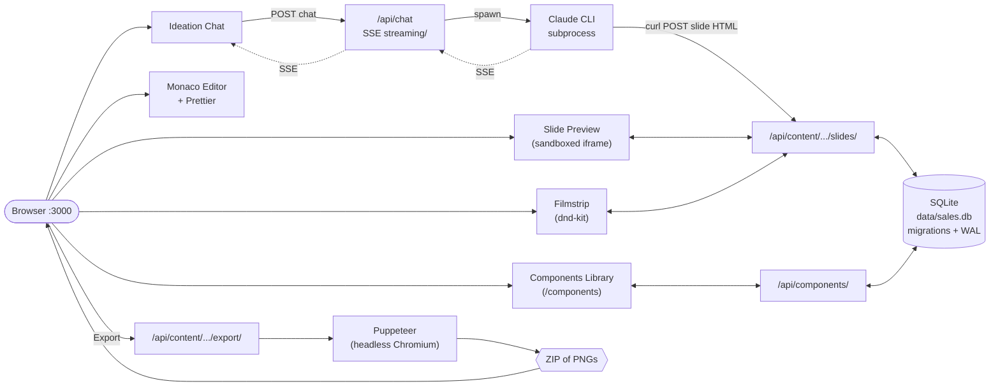

# Open Social

### Chat with Claude. Design Instagram content. Export pixel-perfect PNGs.

**Local-first. Open source. One command to start.**

[License: MIT](./LICENSE)
[Built with Claude](https://claude.ai)
[Next.js 16](https://nextjs.org)
[React 19](https://react.dev)
[TypeScript](https://www.typescriptlang.org)
[Tailwind v4](https://tailwindcss.com)

> Based on **[Hainrixz/open-carrusel](https://github.com/Hainrixz/open-carrusel)** — original work and design.


---

## Table of contents

- [Why Open Social](#-why-open-social)
- [Quickstart (60 seconds)](#-quickstart-60-seconds)
- [What you can do](#-what-you-can-do)
- [How the AI agent works](#-how-the-ai-agent-works)
- [Components library](#-components-library)
- [Slash commands](#-slash-commands)
- [Architecture](#-architecture)
- [Tech stack](#-tech-stack)
- [Project structure](#-project-structure)
- [Configuration](#%EF%B8%8F-configuration)
- [Database & migrations](#-database--migrations)
- [Troubleshooting](#-troubleshooting)
- [Roadmap](#%EF%B8%8F-roadmap)
- [Contributing](#-contributing)
- [Acknowledgments](#-acknowledgments)
- [License](#-license)

---

## ✨ Why Open Social

Designing Instagram content eats hours. You either:

- Pay $20–60/month for a closed-source tool that limits how creative you can get
- Wrestle Canva templates that everyone else also uses
- Hand-craft slides in Figma and lose your weekend

**Open Social takes a different bet.** You chat with Claude — the same model many designers already trust — and it generates real HTML/CSS slides that get screenshotted to PNGs at exact Instagram dimensions. Slides are unique, on-brand, and pixel-perfect. Everything runs on your laptop. Nothing is sent to a cloud you don't control.

It's open source under MIT. Fork it, tweak the system prompt, ship your own variant. No accounts. No subscriptions. No vendor lock-in.

---

## 🚀 Quickstart (60 seconds)

> First run takes 1–2 minutes (Puppeteer downloads ~300 MB of Chromium for PNG export). After that, every launch is seconds.

### One-command path (recommended)

1. **Install [Claude Code](https://docs.anthropic.com/en/docs/claude-code)** and authenticate.
2. **Clone and open the repo** in Claude Code:
  ```bash
   git clone https://github.com/farena/open-social.git
   cd open-social
   claude
  ```
3. In the Claude Code prompt, type:
  ```
   /start
  ```

That's it. Dependencies install, the SQLite DB is created and migrated, the dev server starts, your browser opens. Now design content by chatting.

### Manual path (if you don't use Claude Code)

```bash
git clone https://github.com/farena/open-social.git
cd open-social
npm run setup        # installs deps + seeds /data/ + applies migrations
npm run dev          # starts http://localhost:3000
```

You won't get the AI chat without Claude Code installed (the in-app agent shells out to the `claude` CLI), but the editor, components library, and export still work for static slides.

---

## 🧰 What you can do

- **Two-mode workspace** designed for flow: ideation chat (left) plus a content table on the dashboard, or a slide editor with live preview when you open a content item.
- **Generate content by chatting**: "Make me a 5-slide carousel about productivity habits — bold sans-serif, dark mode, accent red." Watch slides stream in.
- **Iterate per slide**: "Make slide 3 more minimal", "Change the accent to teal", "Swap the hook for something punchier."
- **Three Instagram aspect ratios** ready to go: 1:1 (1080×1080), 4:5 (1080×1350), 9:16 (1080×1920).
- **Brand config** — name, color palette, fonts, logo, style keywords. Claude reads it before every generation so output stays on-brand.
- **Business context** — describe your product/audience once; Claude uses it for ideation and copywriting.
- **Components library** — save any container as a parametric HTML component (button, card, phone mockup, etc.) with `{{key}}` interpolation, then reuse it in any slide. See below.
- **Asset library** — register reusable images (logos, photos) with descriptions so Claude can pick the right one when designing.
- **Templates** — save any content item as a template, reuse it for the next one.
- **Style presets** — switchable look-and-feel applied across slides.
- **Reference images** — drop in screenshots of content you love. Claude studies them to match style.
- **Code-first editing** — Monaco editor with Prettier formatting for the HTML/CSS of any slide or component.
- **Drag to reorder** slides via dnd-kit. Per-slide undo via version history.
- **Safe-zone overlay** to verify nothing important crops behind Instagram's UI.
- **Fullscreen preview** for the final review.
- **One-click export** — Puppeteer screenshots each slide HTML at the exact pixel dimensions Instagram expects, zips them, downloads.
- **Captions + hashtags** generator built into the editor.
- **All local** — content, brand, components, uploads, exports all live in `/data/sales.db` and `/public/uploads/`. Nothing is sent to a cloud you don't control. The only network call is when Claude Code talks to Anthropic.

---

## 💬 How the AI agent works

The in-app agent is the **Claude CLI** spawned as a subprocess from `/api/chat` with `--allowedTools Bash WebFetch`. Messages stream back to the browser via Server-Sent Events.

When you ask for a slide, Claude:

1. Reads your brand config + business context + active content item state from the system prompt
2. Writes the slide as a complete HTML/CSS string
3. POSTs it to `/api/content/[id]/slides` via `curl` (using its `Bash` tool)
4. The new slide appears in your filmstrip seconds later

### Example chat

```
You    > Create a 5-slide carousel about "3 morning habits that
         actually move the needle." Punchy, dark mode, accent red,
         portrait 4:5.

Claude > Coming up. I'll build a hook slide, three habit slides,
         and a CTA. Working...
         [streams 5 HTML slides into the filmstrip]

You    > Slide 3 — the headline is too long. Cut it in half and
         move the icon to the top.

Claude > Done.
         [updates that slide; you can undo if you preferred the old one]
```

### How the slides become PNGs

Slides are stored as **body-level HTML** (no `<html>`/`<head>`/`<!DOCTYPE>`). The shared function `wrapSlideHtml()` in `[src/lib/slide-html.ts](./src/lib/slide-html.ts)` wraps that body into a full document — adding font loading, dimension constraints, and box-sizing reset — and serves it both:

- to a **sandboxed `<iframe>`** for live preview in the editor
- to **Puppeteer (headless Chromium)** for export, screenshot at exact Instagram pixel dimensions, zipped, downloaded

Because the same wrap function feeds both paths, what you see is exactly what you export. No surprises.

---

## 🧩 Components library

A reusable library of parametric HTML components — buttons, cards, phone/Safari mockups, anything you find yourself rebuilding.

- **Save any container as a component** from the slide editor. The current `htmlContent` + `scssStyles` become the master.
- **`{{key}}` interpolation** — declare parameters (typed: text, color, image URL, number) with defaults. The renderer substitutes `{{key}}` against per-instance values at slide render time.
- **Browse and edit** masters at `/components` — grid view with thumbnails (auto-generated via Puppeteer), search, and tag filter.
- **Insert into a slide** — pick a component from the library, override the parameters you want, drop it in. Each insertion is a snapshot copy: edit the master later, existing instances don't change.
- **Claude can use them too.** The chat system prompt advertises the available components so the agent can compose slides from them when relevant.

Storage: `components` table in SQLite. Master images (thumbnails) live under `/public/uploads/`. See `[docs/plans/2026-05-02-html-components-library.md](./docs/plans/2026-05-02-html-components-library.md)` for the full design.

---

## 🛠 Slash commands

Type these inside Claude Code:


| Command         | What it does                                                                                            |
| --------------- | ------------------------------------------------------------------------------------------------------- |
| `/start [port]` | Install + seed + migrate + run + open browser. Idempotent — re-running on a healthy install is seconds. |
| `/stop [port]`  | Kill the dev server. Defaults to `:3000`, accepts a port arg matching `/start`.                         |
| `/reset`        | Wipe local content items, templates, components, brand config, uploads, exports — and re-seed defaults. Asks first. |
| `/doctor`       | Run setup diagnostics: Node version, Claude CLI on PATH, deps installed, DB present, port free.         |
| `/run-ingest`   | Update the project wiki (`wiki/`) from recent code/decision changes.                                    |


You can also run them outside Claude Code:

```bash
npm run setup              # install + seed + migrate
npm run dev                # start the dev server
npm run build              # production build
npm run doctor             # run scripts/doctor.mjs (works pre-`npm install`)
npm test                   # vitest suite
npm run migrate            # apply pending DB migrations (dev DB)
npm run migrate:undo       # revert the most recent migration (dev DB)
npm run migrate:test       # apply migrations to the test DB (data/test.db)
npm run migrate:test:undo  # revert on the test DB
```

---

## 🏗 Architecture


```mermaid
flowchart LR
  U(["Browser :3000"])
  C["Ideation Chat"]
  P["Slide Preview<br/>(sandboxed iframe)"]
  F["Filmstrip<br/>(dnd-kit)"]
  ED["Monaco Editor<br/>+ Prettier"]
  LIB["Components Library<br/>(/components)"]
  API["/api/chat<br/>SSE streaming/"]
  CCLI["Claude CLI<br/>subprocess"]
  SLIDES["/api/content/.../slides/"]
  COMPS["/api/components/"]
  DB[("SQLite<br/>data/sales.db<br/>migrations + WAL")]
  EXP["/api/content/.../export/"]
  PUP["Puppeteer<br/>(headless Chromium)"]
  ZIP{{"ZIP of PNGs"}}

  U --> C & P & F & ED & LIB
  C -- "POST chat" --> API
  API -- "spawn" --> CCLI
  CCLI -. "SSE" .-> API
  API -. "SSE" .-> C
  CCLI -- "curl POST slide HTML" --> SLIDES
  SLIDES <--> DB
  COMPS <--> DB
  P <--> SLIDES
  F <--> SLIDES
  LIB <--> COMPS
  U -- "Export" --> EXP
  EXP --> PUP
  PUP --> ZIP
  ZIP --> U
```


**Why these choices:**

- **Local-first, single-user.** The whole app is a localhost web app talking to a local SQLite file. No cloud, no auth, no remote DB.
- **Claude CLI as the agent.** Lets us reuse the user's existing Claude Code authentication, capabilities, and context. The subprocess gets `Bash` (to `curl` the slide-write endpoints) and `WebFetch` (for research while designing).
- **Slides as HTML.** Claude already writes great HTML/CSS — way more flexible than canvas, way easier to debug than a JSON DSL. The same HTML powers preview *and* export, so what you see is what you ship.
- **Sandboxed iframes.** No `<script>` tags allowed (enforced by the iframe `sandbox=""` attribute). Slides can't run code or escape their box.
- **SQLite via better-sqlite3.** Single file at `data/sales.db`, WAL mode, Sequelize-style migrations under `migrations/`. Reads and writes go through typed accessors in `src/lib/` (e.g. `content-items.ts`, `components.ts`, `templates.ts`). Replaces the original JSON-file storage layer (you may still see `*.json.bak.*` files from the migration window in `/data/`).
- **Components library.** Parametric HTML snippets with `{{key}}` interpolation. Insertions are snapshot copies — editing the master never silently mutates existing slides.

For more, see `[CLAUDE.md](./CLAUDE.md)` — the architecture doc tuned for AI assistants working on this codebase, the design plans under `[docs/plans/](./docs/plans/)`, and the project wiki under `[wiki/](./wiki/)` for decisions, incidents, and external context.

---

## 📦 Tech stack


| Layer         | Tool                                                                           |
| ------------- | ------------------------------------------------------------------------------ |
| Framework     | [Next.js 16](https://nextjs.org) (Turbopack), [React 19](https://react.dev)    |
| Language      | TypeScript 5                                                                   |
| Styling       | [Tailwind CSS v4](https://tailwindcss.com) (CSS-first config in `globals.css`) |
| UI primitives | [Radix UI](https://www.radix-ui.com), [lucide-react](https://lucide.dev)       |
| Rich-text     | [Lexical](https://lexical.dev) for slide text editing                          |
| Code editor   | [Monaco](https://microsoft.github.io/monaco-editor/) + [Prettier](https://prettier.io) for HTML/CSS |
| Drag/drop     | [@dnd-kit](https://dndkit.com)                                                 |
| AI agent      | [Claude CLI](https://docs.anthropic.com/en/docs/claude-code) subprocess        |
| Image export  | [Puppeteer](https://pptr.dev), [Sharp](https://sharp.pixelplumbing.com)        |
| Zipping       | [Archiver](https://github.com/archiverjs/node-archiver)                        |
| Storage       | [better-sqlite3](https://github.com/WiseLibs/better-sqlite3) + custom migration runner |
| Search        | [MiniSearch](https://lucaong.github.io/minisearch/) (wiki BM25 lookup)         |
| Validation    | [Zod](https://zod.dev) schemas for ContentItem, slides, and components         |
| Testing       | [Vitest](https://vitest.dev)                                                   |


---

## 📁 Project structure

```
open-social/
├── .claude/
│   └── commands/             ← /start, /stop, /reset, /doctor, /run-ingest (slash commands)
├── data/                     ← user state (gitignored): sales.db (SQLite + WAL), exports/, legacy *.bak files
├── docs/
│   └── plans/                ← design docs for non-trivial features (components library, SQLite migration, ...)
├── migrations/               ← Sequelize-style SQL migrations (YYYYMMDDHHMMSS-*.ts) + README
├── public/uploads/           ← user uploads (gitignored): logos, reference images, component thumbnails
├── scripts/
│   ├── setup.mjs             ← npm install + seed data dirs + migrate + Claude CLI detection
│   ├── doctor.mjs            ← env diagnostic (zero deps, runs pre-install)
│   ├── migrate.ts            ← migration runner (better-sqlite3, transactional, tracked in `migrations` table)
│   └── wiki-query/           ← BM25 wiki search CLI (`npx wiki-query "..."`)
├── src/
│   ├── app/
│   │   ├── api/              ← backend routes:
│   │   │                        chat, content, content/[id]/slides, content/[id]/export,
│   │   │                        components, components/[id], components/from-element,
│   │   │                        brand, business-context, templates, style-presets,
│   │   │                        assets, staged-actions, upload, fonts
│   │   ├── content/[id]/     ← content item editor page
│   │   ├── components/       ← components library page (grid + detail editor)
│   │   ├── carousel/[id]/    ← legacy redirect → /content/[id]
│   │   ├── business-context/ ← business context page
│   │   ├── globals.css       ← Tailwind v4 theme + motion tokens
│   │   ├── layout.tsx
│   │   └── page.tsx          ← dashboard (content items table + ideation chat)
│   ├── components/
│   │   ├── brand/            ← BrandSetup, ColorPicker, FontSelector, LogoUpload
│   │   ├── business-context/ ← business/audience configuration UI
│   │   ├── chat/             ← ChatPanel, ChatMessage, ChatInput, ReferenceImages
│   │   ├── content/          ← ContentItem detail + ideation surfaces
│   │   ├── dashboard/        ← ContentItemsTable, IdeationChat
│   │   ├── editor/           ← Preview, SlideFilmstrip, SlideRenderer, ExportButton, Monaco wrapper, ...
│   │   ├── library/          ← ComponentsGrid, ComponentEditor, ComponentInsertModal, ParametersMetadataEditor, ...
│   │   ├── layout/           ← TopBar
│   │   ├── templates/        ← TemplateGallery, TemplateCard
│   │   └── ui/               ← Button, Input, Badge, ConfirmDialog, dialogs
│   ├── lib/
│   │   ├── chat-system-prompt.ts          ← dynamic system prompt (brand + content item + components)
│   │   ├── content-generation-system-prompt.ts
│   │   ├── content-idea-system-prompt.ts
│   │   ├── ideation-system-prompt.ts
│   │   ├── context-chat-system-prompt.ts
│   │   ├── slide-html.ts                   ← wrapSlideHtml() — the rendering contract
│   │   ├── slide-serializer.ts             ← element → HTML, runs {{key}} interpolation for components
│   │   ├── slide-migrator.ts               ← per-slide schema migration on read
│   │   ├── content-items.ts                ← ContentItem + slide CRUD with version history (SQLite)
│   │   ├── content-item-snapshots.ts       ← undo history
│   │   ├── components.ts                   ← components library CRUD + saveFromElement
│   │   ├── component-interpolation.ts      ← {{key}} substitution + key extraction
│   │   ├── component-thumbnail.ts          ← Puppeteer-based thumbnail generation
│   │   ├── component-schema.ts             ← Zod schemas for components
│   │   ├── content-item-schema.ts          ← Zod schemas for content items
│   │   ├── slide-schema.ts                 ← Zod schemas for slide elements
│   │   ├── assets.ts                       ← reusable image asset registry
│   │   ├── staged-actions.ts               ← deferred actions (e.g. PNG exports the agent queued)
│   │   ├── templates.ts, style-presets.ts, brand.ts, business-context.ts
│   │   ├── db.ts                           ← better-sqlite3 connection + SCHEMA_SQL bootstrap
│   │   ├── claude-path.ts                  ← portable Claude CLI discovery
│   │   ├── kv-config.ts                    ← simple key/value config store
│   │   └── __tests__/                      ← unit tests (Vitest)
│   └── types/                ← shared TypeScript types (content-item, slide-model, component, asset, ...)
├── tests/                    ← integration tests + DB fixtures
├── wiki/                     ← project wiki (decisions, incidents, external context)
├── AGENTS.md                 ← rules for AI agents (Next.js 16-specific)
├── CLAUDE.md                 ← architecture doc for AI assistants working on this code
├── LICENSE                   ← MIT
├── README.md                 ← you are here
├── next.config.ts
├── package.json
└── tsconfig.json
```

---

## ⚙️ Configuration

### Environment variables (`.env.local`)

Created automatically by `scripts/setup.mjs` if it can find your Claude CLI. You can override:

```bash
CLAUDE_CLI_PATH=/path/to/claude   # set if `which claude` doesn't find it
TEST_DB_PATH=/path/to/test.db     # optional override for npm run migrate:test (defaults to data/test.db)
```

On Windows, run `where claude` in PowerShell to find the path (typically `C:\Users\<you>\AppData\Roaming\npm\claude.cmd`), then set `CLAUDE_CLI_PATH` in `.env.local`.

### Brand config

Set on first run (or via the gear icon in the top bar). Stored in SQLite. Fields:

- **Name** — your handle / company / project
- **Colors** — primary, secondary, accent, background, surface
- **Fonts** — heading + body (Google Fonts; the `/api/fonts` endpoint serves a curated list)
- **Logo** — optional; used by Claude when you ask for branded slides
- **Style keywords** — free-text style hints ("editorial, minimalist, warm tones") that get injected into Claude's system prompt

### Business context

Describe your product, ICP and tone once (`/api/business-context`). Stored in SQLite. The ideation system prompt reads it so Claude proposes content angles that fit your audience.

### Templates & components

- **Templates** — save any content item as a template via the bookmark icon in the editor toolbar. Visible in the dashboard's Templates tab.
- **Components** — save any container as a parametric component from the slide editor. Visible at `/components`.

Both stored in SQLite.

### Reference images & assets

- **Reference images** — drop screenshots into the chat panel's "Reference Images" section. Stored under `/public/uploads/`. Claude Code can read them via `WebFetch` of the local URL when designing.
- **Asset library** — register reusable images (logos, photos, illustrations) with names and descriptions so Claude knows what's available and can pick the right one.

---

## 🗄 Database & migrations

Storage is SQLite at `data/sales.db` (WAL mode), accessed via `better-sqlite3`. Schema changes use a Sequelize-style runner.

- Migration files: `migrations/YYYYMMDDHHMMSS-description.ts`, exporting `up(db)` / `down(db)` (better-sqlite3 connection).
- Tracked in the `migrations` table; each step runs in a `BEGIN IMMEDIATE` transaction.
- Two parallel sources of truth — keep them in sync when adding schema:
  - `SCHEMA_SQL` in `src/lib/db.ts` — bootstraps fresh DBs and tests.
  - `migrations/*.ts` — upgrades existing DBs.
- Use the `:test` variants while iterating so you don't clobber the dev DB:

```bash
npm run migrate            # apply pending migrations to data/sales.db
npm run migrate:undo       # revert the most recent migration
npm run migrate:test       # same, against data/test.db (or $TEST_DB_PATH)
npm run migrate:test:undo  # revert on the test DB
```

Full docs: `[migrations/README.md](./migrations/README.md)`.

---

## 🩺 Troubleshooting

`**/start` says "Node v18 detected, need ≥20."**
Next.js 16 requires Node 20+. Install via [nodejs.org](https://nodejs.org) or [nvm](https://github.com/nvm-sh/nvm).

`**/start` says "Claude CLI not found."**
Install [Claude Code](https://docs.anthropic.com/en/docs/claude-code) and authenticate. The setup script searches `~/.local/bin/claude`, `/usr/local/bin/claude`, `/opt/homebrew/bin/claude`, `~/.npm-global/bin/claude`, and `$CLAUDE_CLI_PATH`. If yours lives elsewhere, set `CLAUDE_CLI_PATH` in `.env.local`.

**Port 3000 is in use.**
Run `/stop` to kill whatever's there, or run `/start 3001` to use a different port.

**Export fails or hangs.**
Likely a Puppeteer/Chromium issue. Try `rm -rf node_modules && npm install` to re-trigger the Chromium download. On Linux you may need `apt install` of common Chromium dependencies (libnss3, libatk1.0-0, libxss1, etc.).

**Slides look fine in preview but export looks different.**
That shouldn't happen — both go through `wrapSlideHtml()`. If it does, file an issue with the slide HTML attached.

**The AI keeps generating slides that ignore my brand colors.**
Open the brand setup (gear icon) and confirm your colors and style keywords are saved. They're injected into Claude's system prompt on every chat request via `chat-system-prompt.ts`.

**A migration broke the DB.**
Roll back with `npm run migrate:undo`. If you're iterating, always test against `data/test.db` first via `npm run migrate:test` / `npm run migrate:test:undo`.

**Run `/doctor`** for a full env audit — it'll tell you which of the above applies.

---

## 🗺️ Roadmap

Open ideas — PRs welcome.

- **Multi-language slide generation** — Spanish-LATAM voice presets so creators don't fight the AI's English defaults
- **Reels storyboard mode** — vertical 9:16 with optional text-on-clip annotations
- **Twitter/X thread export** — same brand voice, different surface
- **Notion / Linear export** — push the content as a doc with each slide as a section
- **Theme presets gallery** — community-curated style presets you can one-click apply
- **Per-slide AI chat** — a smaller chat thread scoped to a single slide
- **Components marketplace** — share and import components across projects
- **Hosted demo** — for people who want to try before installing Claude Code

---

## 🤝 Contributing

PRs welcome. The bar:

- **Run `npm run doctor`, `npm test` and `npm run build`** before opening a PR — all should pass clean.
- **Follow the file conventions** in `[CLAUDE.md](./CLAUDE.md)` — components ≤ 300 lines, types in `src/types/`, libs in `src/lib/`, `cn()` from `src/lib/utils.ts` for class merging, all data writes through the typed accessors in `src/lib/` (never direct SQL or fs writes).
- **Don't touch the slide rendering contract.** `wrapSlideHtml()` in `src/lib/slide-html.ts` is the seam between preview and export. Change it carefully and test the export round-trip.
- **Schema changes need a migration.** Add `migrations/YYYYMMDDHHMMSS-*.ts` with `up()` / `down()`, and update `SCHEMA_SQL` in `src/lib/db.ts` so fresh installs match. Validate with `npm run migrate:test` round-trip.
- **Wiki-first for non-trivial changes.** Read `wiki/index.md` before refactors that touch slide pipeline / chat / export / data layer / API contracts. After landing a decision-bearing change, run `/run-ingest`.

---

## 🙏 Acknowledgments

- **[Hainrixz/open-carrusel](https://github.com/Hainrixz/open-carrusel)** — Open Social is a fork of the original `open-carrusel` project by [tododeia](https://www.tododeia.com) (Enrique Rocha). The chat-driven carousel concept, slide HTML rendering contract, three-panel editor, and most of the foundational code came from there. All credit for the original design goes to them.
- **[Emil Kowalski](https://emilkowal.ski)** — animation philosophy that shaped the whole motion system. The `oc-`* CSS classes encode his design-engineering principles (custom easings, restraint over excess, `@starting-style` over JS for entries).
- **[Anthropic](https://www.anthropic.com)** — Claude (the model) and Claude Code (the CLI) are the brain of the in-app agent.
- **[Vercel](https://vercel.com)** — Next.js + Turbopack make local-first React apps feel snappy.
- **[Radix UI](https://www.radix-ui.com)** + **[shadcn/ui](https://ui.shadcn.com)** — the patterns underneath the dialog/button/input primitives.
- **[dnd-kit](https://dndkit.com)** — the only sane drag-and-drop story in React.
- **[Puppeteer](https://pptr.dev)** + **[Sharp](https://sharp.pixelplumbing.com)** — the export pipeline.
- **[better-sqlite3](https://github.com/WiseLibs/better-sqlite3)** — synchronous, fast, embedded storage.
- **[Monaco](https://microsoft.github.io/monaco-editor/)** + **[Prettier](https://prettier.io)** — the in-app code editor.

---

## 📄 License

[MIT](./LICENSE) — do anything you want with it. Attribution appreciated, never required.
